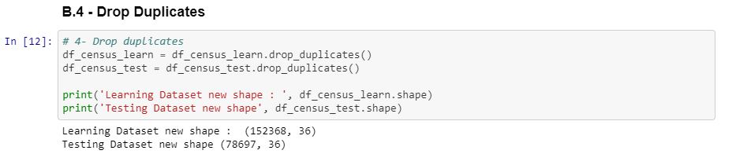

# Dataiku_test

# Instruction
The following link lets you download an archive containing an “exercise” US Census dataset: http://thomasdata.s3.amazonaws.com/ds/us_census_full.zip This US Census dataset contains detailed but anonymized information for approximately 300,000 people.

The archive contains 3 files:

A large learning .csv file
Another test .csv file
A metadata file describing the columns of the two above mentioned files (identical for both)
The goal of this exercise is to model the information contained in the last column (42nd), i.e., which people make more or less than $50,000 / year, from the information contained in the other columns. The exercise here consists of modeling a binary variable.

Work with R or Python to carry out the following steps:

Import the learning and text files
Based on the learning file:
Make a quick statistic based and univariate audit of the different columns’ content and produce the results in visual / graphic format. This audit should describe the variable distribution, the % of missing values, the extreme values, and so on.
Create a model using these variables (you can use whichever variables you want, or even create you own; for example, you could find the ratio or relationship between different variables, the one-hot encoding of “categorical” variables, etc.) to model wining more or less than $50,000 / year. Here, the idea would be for you to test one or two algorithms, such as logistic regression, or a decision tree. Feel free to choose others if wish.
Choose the model that appears to have the highest performance based on a comparison between reality (the 42nd variable) and the model’s prediction.
Apply your model to the test file and measure it’s real performance on it (same method as above).
The goal of this exercise is not to create the best or the purest model, but rather to describe the steps you took to accomplish it. Explain areas that may have been the most challenging for you. Find clear insights on the profiles of the people that make more than $50,000 / year. For example, which variables seem to be the most correlated with this phenomenon? Finally, you push your code on GitHub to share it with me, or send it via email.

Once again, the goal of this exercise is not to solve this problem, but rather to spend a few hours on it and to thoroughly explain your approach.

# A - Exploring the Datasets
    Get to know more about the datasets shape
    

# B - Data Cleaning
    Drop useless columns

# C - Feature engineering

# D - Apply models

# Conclusion
    The model can be improved. There is 72% precision and only 37% recall for detecting someone that has more than 50 000$ revenue. The AdaBoost model is slightly better in this case. After iterating several times these difference seems to be constant.

    The model do not have satisfying enough results. A way to improve it could be not to consider outlayers for some continuous variables and replace them with the means. Or only consider people over a certain age.

    But so far it gives use insights on what features has the most impact on "Having or not more than 50 000$ revenue". The 4 most important are:
    1. Capital Gain
    2. Dividends from stocks
    3. Detailed Occupation Recode
    4. Weeks work in year
